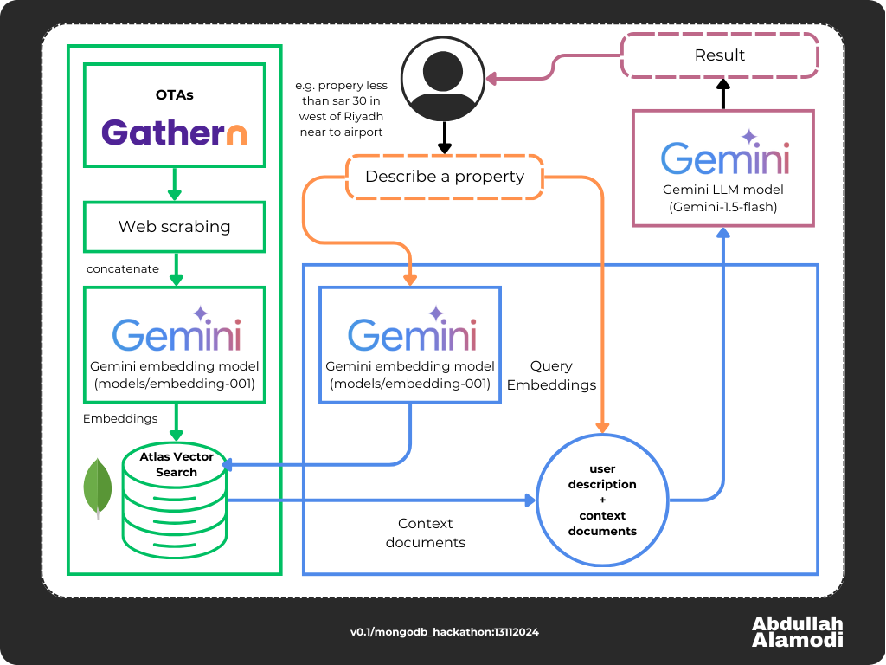

    

## **Inspiration**
Riyadh GeoFind provides a list of properties in Riyadh city based on user descriptions. The user first describes the desired place, and the AI app will find the desired properites based on their description. The app will plot the found places on the map, providing information such as `unit code`, `name`, `description`, and `location`. Moreover, the app will generate text powered by `Gemini Flash 1.5` to explain each property, including its pros and cons, when there is no exact match for the description. The current version (`MongoDB AI hackathon version`) supports searching by `name`, `location` (south, east, etc.), `description`, and `amenities`. Therefore, the app will return results withen the desired location if it is described by the host (refer to fig 1).

    

    <em>figure 1</em>

The AI app is not bilingual, as the input is written in Arabic, which is one of the current version's limitations. Another limitation is that the app does not calculate the distance between locations (e.g., from property X to the airport) if does not described by the host. It only provides results if the host mentions specific distances in the description (e.g. near to airport, bolivard, etc.). Lastly, the database only contains vacation rentals crawled from [Gathern](https://gathern.co) website.

## **How I Built It**
I built the app using the RAG framework. The following online resources helped me to complete the app:

- [MongoDB Developer Center - RAG with Atlas Vector Search, LangChain, and OpenAI](https://www.mongodb.com/developer/products/atlas/rag-atlas-vector-search-langchain-openai/)
- [MongoDB Developer Center - Quickstart Guide to RAG Application](https://www.mongodb.com/developer/products/atlas/guide-to-rag-application/)
- [LangChain Documentation - Google Generative AI Embeddings](https://python.langchain.com/docs/integrations/text_embedding/google_generative_ai/)
- [LangChain Documentation - Chat with Google Generative AI](https://python.langchain.com/docs/integrations/chat/google_generative_ai/)

## **Challenges We Ran Into**
The main challenge was with LangChain. The **MongoDB** online tutorial was published recently, but the code does not work, and many methods used are deprecated (e.g., `chain.run`). The LangChain documentation is a nightmare (compared with MongoDB, Gradio, and Huggingface), especially for Google LLMs integration.

## **Accomplishments That We're Proud Of**
Riyadh GeoFind 😍

## **What We Learned**
- LangChain with Google LLMs
- Deployment with Gradio
- How to embed data in MongoDB Atlas Vector Search

## **What's Next for Riyadh GeoFind: A Smart Map Search for Riyadh City**
- Bilingual RAG app
- Integration with Google Maps
- Calculate distances based on user requirements
- Add hotels to the database
- Rebuild the ui with Reflex framework
